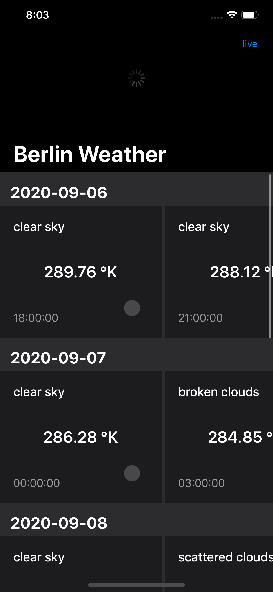
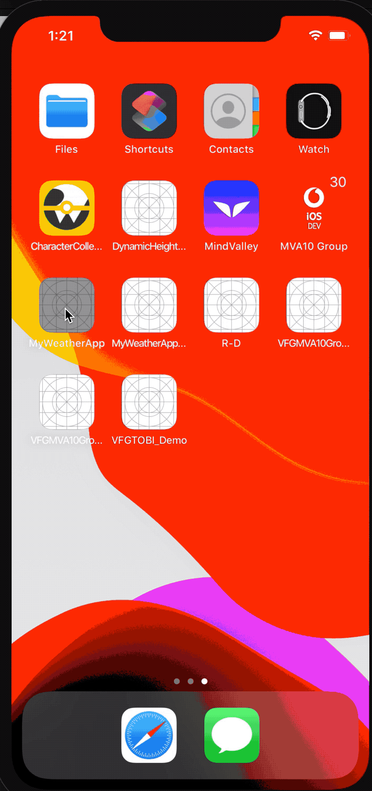

# MyWeatherApp
MyWeather app is a simple demo app that shows weather forecasts for the upcoming five days

## Getting started with MyWeatherApp

### The Basic functionalities and chosen App architecture : 

-  MVVM design pattern applied in the demo app
-  Class and method name clearly show their intent and responsibility.
-  Simple UI Design  
-  “SOLID” Principles applied
-  Easily to accommodate possible future requirement changes
-  No 3rd party frameworks
-  The navigation bar button added with the title`cached` and `live` to represent the current data source and you can switch between them.

### added features
 
- Pull to refresh feature implemented
- Unit testing coverage 90% + sample UI test
- browse app offline with the cached
- dark mode implemented
- Shimmering
- handling error while fetching: I just added a label with loading failed on the right top of the screen in case of failed to fetch live response

### native components:

- Network layer: I have built it to be testable and cancellable so when user press cached then live multiple times the previous request will be canceled.
- Shimmering: I added native simple ShimmerView to make a shimmering effect in case first of first time loading otherwise and in switching I will not show shimmering again i will keep the cached version.

### resources

use `forecasts_stub.json` in resources group if you want to change the cached forecasts

### Some points that may need some enhancement and refining:

- Network request: as we fetch one city forecasts so I did not build the request protocol to be general for any endpoint

- Shimmering views: it is good to show shimmering views while the screen starts loading for first time especially in case of the poor network but while switching will keep the cached presented 
fore simplicity reason I did not handle shimmering views but it is easy to do and put the shimmering cell instead of the actual one until the table loads and then dequeued the real one.

- cell xibs: I usually prefer to use separate xib for each table/collection cell and not to be in the storyboard to be reusable but for simplicity, in this demonstration app I made it implicitly in the storyboard.

  
  

