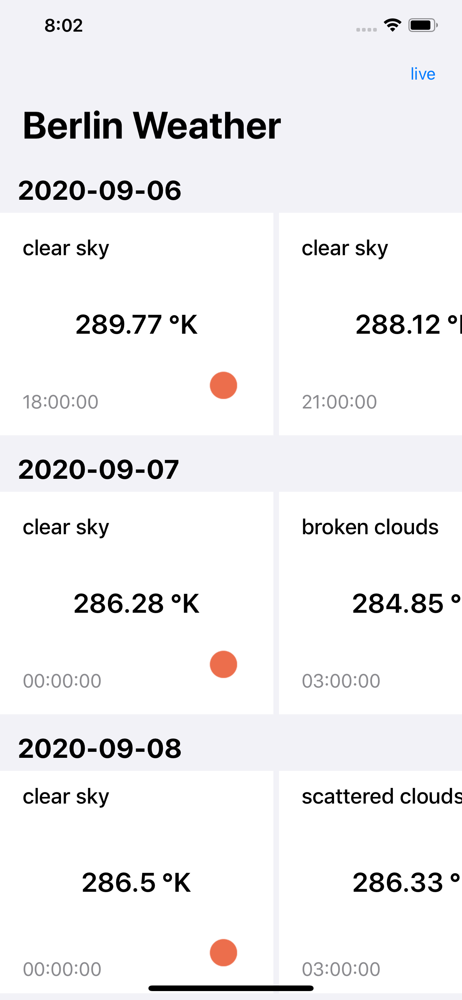

# MyWeatherApp
MyWeather app is simple demo app thats shows weather forecasts for the upcoming five days information for 

## Getting started with MyWeatherApp

### The Basic functionalities and choosen App architecture : 

-  MVVM design pattern applied in the demo app
-  Class and method name clearly show their intent and responsibility.
-  Simple UI Design  
-  “SOLID” Principles applied
-  easily to accommodate possible future requirement changes
-  No 3rd party frameworks
-  navigation bar button added `cached` and `live` to represent the current data source and you can switch between them.

### added features
 
- Pull to refresh feature implemented
- UI and Unit testing coverage 90%
- browse app offline with the cached
- dark mode implemented 

### Some points that may need some enhancement and refining:

- network request : as we fetch one city forecasts so I did not build the request protocol to be general and for any endpoint

- shimmiring views: it is good to show shimmiring views while screen start loading specially in case of poor network but while switching will keep the cached presented 
fore simplicity reason i did not handle shimmring views but it is easy to do and put the shimmiring cell instead of the actual one until table loads and then dequeu the real one.

- cell xibs: I usually prefere to make separate xib for each table / collection cell and not to be in the storyboard to be reusable but for simplicity and this is just demonestration app i made it implicitly in storyboard 
-  `tableView.refreshControl?.beginRefreshing()`: I use table refresh control programatically to show loading but it doesnot work 

  
### native components:

- Network layer: I have built it to be testable and cancellable so when user press cached then live multiple time the previous request will be cancelled.

