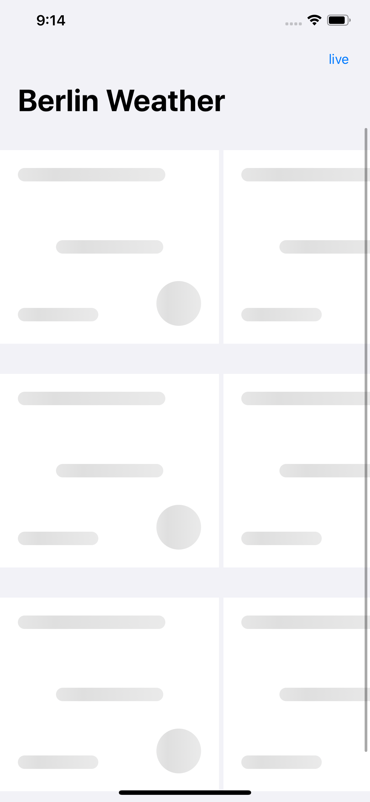
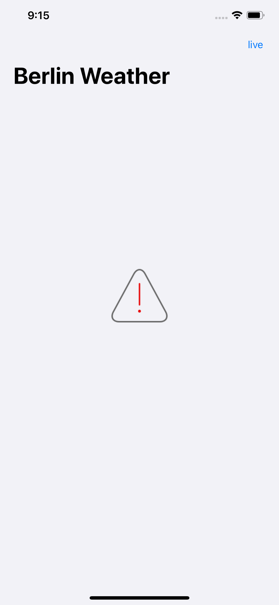
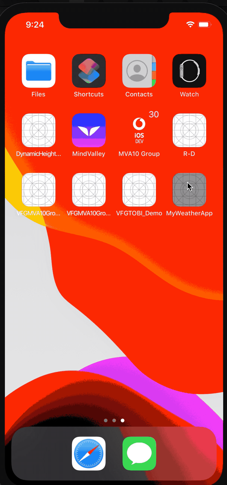

# MyWeatherApp
MyWeather app is a simple demo app that shows weather forecasts for the upcoming five days

## Getting started with MyWeatherApp

### The Basic functionalities and chosen App architecture : 

-  MVVM design pattern applied in the demo app
-  Class and method name clearly show their intent and responsibility.
-  Simple UI Design  
-  “SOLID” Principles applied
-  Easily to accommodate possible future requirement changes
-  No 3rd party frameworks
-  The navigation bar button added with the title`cached` and `live` to represent the current data source and you can switch between them.

### added features
 
- Pull to refresh feature implemented
- Unit testing coverage 90% + sample UI test
- browse app offline with the cached
- dark mode implemented
- Shimmering
- no network error handling for 
- documentation 

### native components:

- Network layer: I have built it to be testable and cancellable so when user press cached then live multiple times the previous request will be canceled.
- Shimmering: I added native simple ShimmerView to make a shimmering effect in case first of first time loading otherwise and in switching I will not show shimmering again i will keep the cached version.

### resources

use `forecasts_stub.json` in the resources group if you want to change the cached forecasts

### Some points that may need some enhancement and refining:

- Network request: as we fetch one city forecasts so I did not build the request protocol to be general for any endpoint

- Data Repository layer: in the demo app the VM responsible for calling the network provider to fetch the response but that as the app is a simple use case so I did not tend to add the data repository abstraction layer that may be better in dealing with the data remote or cached and make handle all caching needed.

- normal scenario 

- dark mode + pull to refresh

- shimmering

- error while start app

- demo

  
